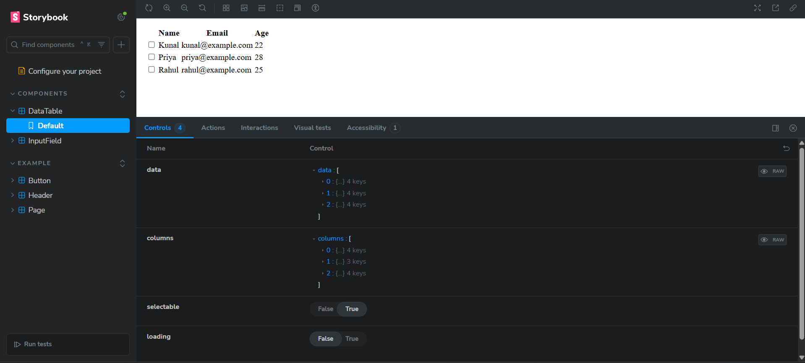
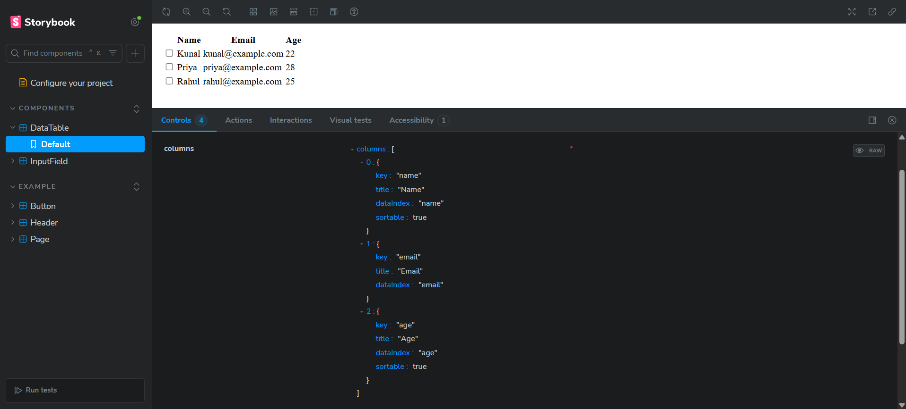
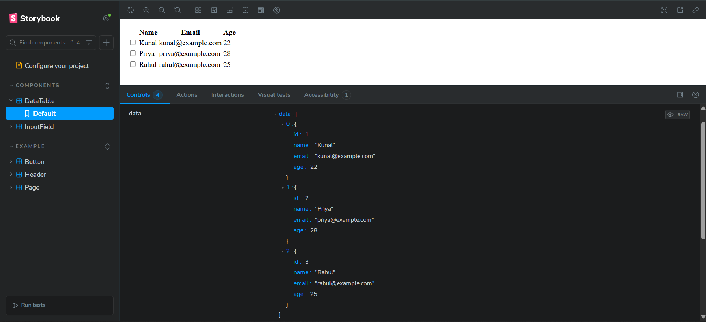
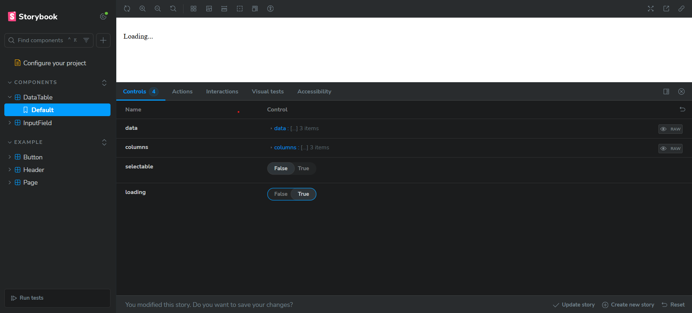
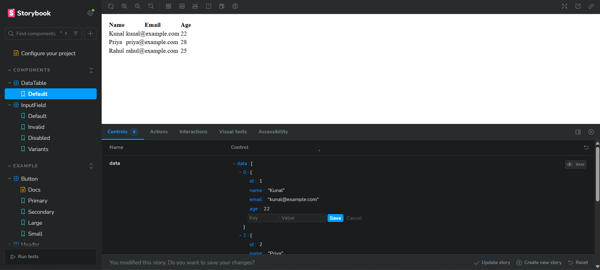
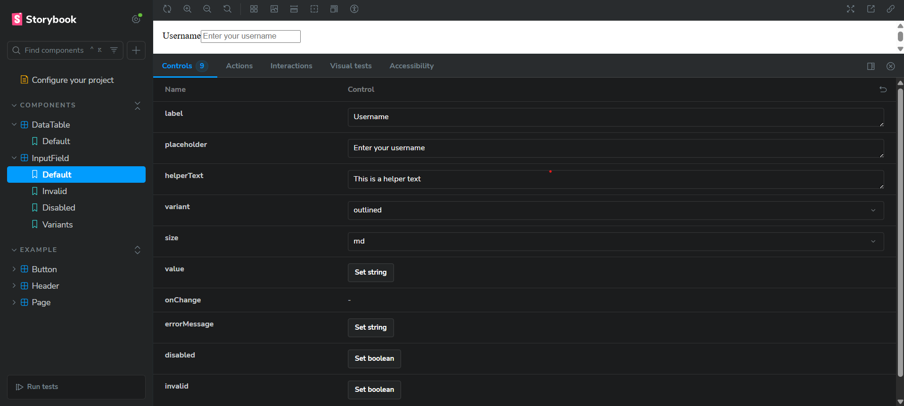
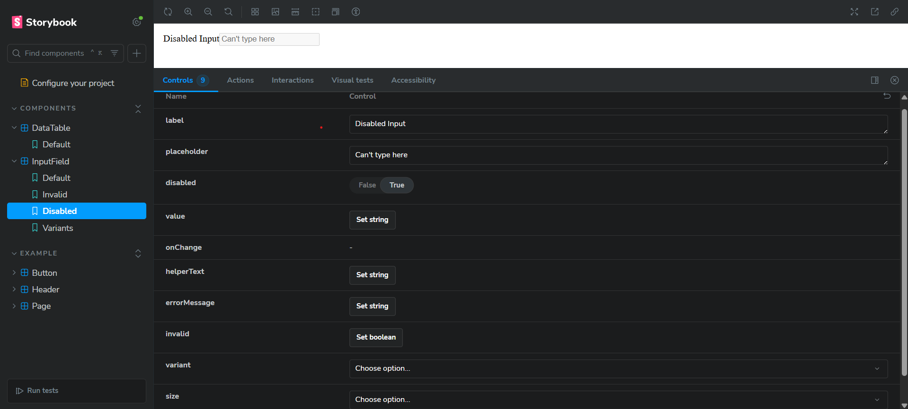
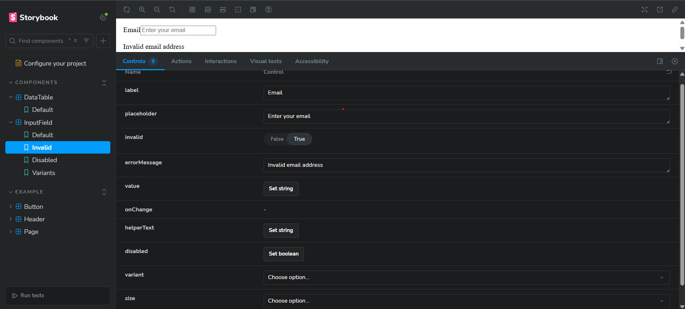
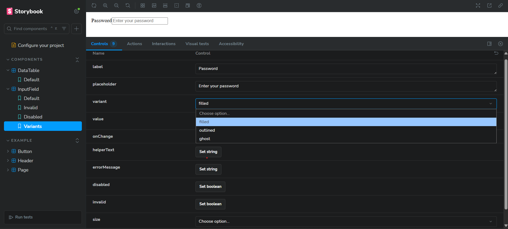

# 🎯 Assignment – UI Components with Storybook

This repository contains **React + TypeScript** UI components developed as part of a company assignment.  
The project follows **modern frontend practices** with **Storybook** for documentation, **Chromatic** for deployment, and **Jest/RTL** for testing.

---

## 📌 Components Implemented

### 🔤 InputField
- Validates user input with error messages  
- Supports multiple input types (text, email, password, etc.)  
- Responsive & accessible (ARIA labels)  
- Clean, reusable design  

### 📊 DataTable
- Displays tabular data with configurable columns  
- Supports sorting, selection (single & multiple), and editing  
- Handles loading/empty states gracefully  
- Accessibility & responsiveness built-in  

---

## 📸 Component Screenshots

### 📊 DataTable
- **Default State**  
  
- **Columns View**  
  
- **Data View**  
  
- **Loading State**  
  
- **Editable State**  
  
- **Selectable Rows**  
  

### 🔤 InputField
- **Default State**  
  
- **Disabled State**  
  
- **Invalid State**  
  
- **Variants**  
  

---

## 🚀 Live Storybook (Chromatic)

👉 [View Storybook Deployment](https://68a73ea3da944f2ba8bfa316-nvxrowlypz.chromatic.com/)

---

## 🛠️ Approach & Best Practices

- **Component-Driven Development:** Each component built/tested in isolation with Storybook  
- **Styling:** TailwindCSS + `cva` for scalable, consistent styling  
- **Type Safety:** TypeScript with strict typing & generics for flexibility  
- **Testing:** Jest + React Testing Library for unit/integration tests  
- **Accessibility:** Semantic HTML + ARIA attributes  
- **CI/CD:** Chromatic for hosting & visual regression testing  

---

## 📂 Project Structure
Assignment/
├── .storybook/ # Storybook configuration
├── src/
│ ├── components/
│ │ ├── InputField/ # InputField component
│ │ └── DataTable/ # DataTable component
│ ├── stories/ # Storybook stories
│ ├── App.tsx
│ └── main.tsx
├── docs/screenshots/ # Component screenshots
├── package.json
├── tsconfig.json
└── README.md

---

## ⚡ Getting Started

```bash
# Clone repo
git clone <your-repo-link>
cd Assignment

# Install dependencies
npm install

# Run Storybook locally
npm run storybook

# Deploy to Chromatic
npm run chromatic
